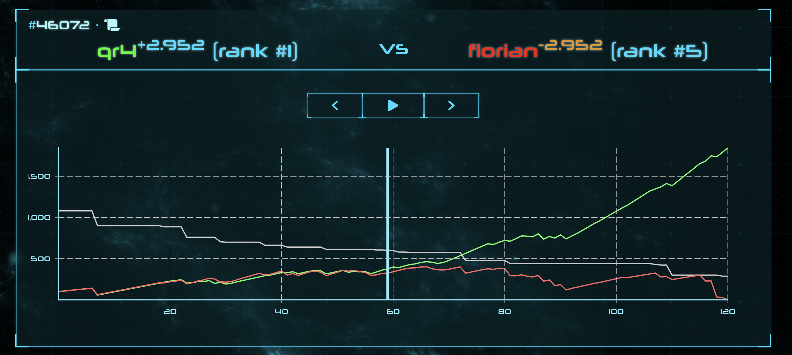
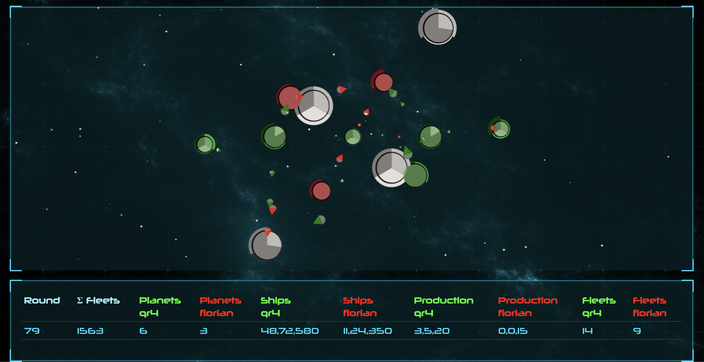

Rocket Paper Spacegoo
======================

Teaser Images
-------------





Disclaimer
---------
All credit for this game goes to the original creators (https://bitbucket.org/dividuum/rocket-scissor-spacegoo).
This is mainly a fork of said repo which makes the game
easier runable on a modern machine (updated dependencies, docker-compose, python3, english language, minor fixes, more game logic). Also a new shiny ui ^_^


What its about: 2 players play either a maximum number of rounds or until
one player is eliminated (has no planets and no ships left). Every player
starts with at least one start planet. Every planet has a fixed ship production
amount, which determines how many new ships will be created in each tick.

Both players connect per TCP socket to a central gameserver. If there are at
least 2 players connected to the server, they will be placed against each other.
In each round / tick, both players receive the whole gamestate as JSON.
There are two possible moves: You can either send an arbitrary amount of ships
from a planet you own to another planet or you can pass. If you do not provide
a valid input within 3 seconds, you will be disqualified and your opponent
wins the game.

Fleets take several rounds until they reach their destination. The duration
is determined by the distance between the planets. If multiple fleets arrive
at the same planet, they will fight until only ships of a single player remain.
If the attacker wins the encounter, the plant changes its affiliation the said player
and starts producing ships according the the producing amount of the planet.

Protocol
---------

Connect to the game server via TCP. The first send command must be

    login <username> <passwort>

If the credentials are now known yet, a new account is created. There exists no
password reset, nor the possibility to delete the account.

Afterwards, arbitrary data is send until a game starts. In this moment, both players
receive the complete gamestate as JSON. Game states always start with a '{'.
You must send a reply within 3 seconds after receiving a gamestate.

There are two valid replies:

    nop

means that you do not want to take any action in the current tick / round.

    send <source_planet_id> <target_planet_id> <num_a> <num_b> <num_c>

means that you want to send a fleet from a planet with id `source_planet_id` which
you control to a planet with id `target_planet_id`. The num_{a,b,c} thereby represent
the amount of ships of each category which will compose the fleet.

As soon as both players made their move, the game will move into the next round / tick
and both players will receive the updated gamestate.

An example gamestate looks as follows:

```
    {
      "game_over": false,
      "winner": null,               // player_id
      "round": 2
      "max_rounds": 500,
      "fleets": [
        {
          "id": 0,
          "owner_id": 1,            // player_id
          "origin": 1,              // planet_id
          "target": 2,              // planet_id
          "ships": [ 3, 1, 1 ],     // Amount of ships of type a, b, c
          "eta": 45                 // the round this fleet will arrive at its destination
        },
        ...
      ],
      "players": [
        {
          "id": 1,
          "name": "dividuum",
          "itsme": true
        },
        {
          "id": 2,
          "name": "cupe",
          "itsme": false
        }
      ],
      "planets": [
        {
          "id": 0,
          "owner_id": 0,            // player_id
          "y": 0,
          "x": 0,
          "ships": [ 20, 20, 20 ],  // current amount of ships of type a,b,c
          "production": [ 1, 1, 1 ], // production of ships in each round/tick of type a, b, c,
          "production_rounds_left": 100 // number of rounds where this planet will still be producing ships
        },
        ...
      ],
      "hyperlanes": [ // contains edges along which travel is allowed
        [0, 1],       // e.g. you can send ships from the first to the second planet 
        [1, 0],
        ...
      ],
    }
```

The game is over as soon as `game_over` is set to true. After such a state is
received, the game is finished and the player will be disconnected from the server.
The player can then connect again to the server for another match.

Fleets arrive at the end of a round at a target planet: E.g. If the ETA is round 10,
then all ships of the fleet will arrive after the input for round 10 was provided and
processed. In round 11 the fleet does not exist anymore.

Planets always belong to a single player. In the beginning each player starts with at
least a single planet on a point symmetric map. The other planets are considered neutral
and belong to a player with the `player_id` 0. These planets do not produce ships, but may
contain already present ships. As soon as a "real" player takes control of the planet, it
starts to produce ships.


Battle-code
---------------
```
def battle_round(attacker,defender):
    # only an asymetric round. this needs to be called twice
    numships = len(attacker)
    defender = defender[::]
    for def_type in range(0,numships):
        for att_type in range(0,numships):
            if def_type == att_type:
                multiplier = 0.1
                absolute = 1
            if (def_type-att_type)%numships == 1:
                multiplier = 0.25
                absolute = 2
            if (def_type-att_type)%numships == numships-1:
                multiplier = 0.01
                absolute = 1
            defender[def_type] -= max((attacker[att_type]*multiplier), (attacker[att_type] > 0) * absolute)
        defender[def_type] = max(0,defender[def_type])
    return defender
```
```
def battle(s1,s2):
   ships1 = s1[::]
   ships2 = s2[::]
   while sum(ships1) > 0 and sum(ships2) >0:
       new1 = battle_round(ships2,ships1)
       ships2 = battle_round(ships1,ships2)
       ships1 = new1
       #print ships1,ships2

   ships1 = map(int,ships1)
   ships2 = map(int,ships2)
   #print ships1,ships2
   return ships1, ships2
   ```


Kind-of-explanatory images:
----------------


Client-Libraries
----------------

Haskell developers should check out
[haskell-spacegoo](https://bitbucket.org/nomeata/haskell-spacegoo)
to easily programm clients

Bots
----------------
- https://github.com/vladhc/space-battles
- https://github.com/Alexandre-Silva/hackerton-freiheit
- https://github.com/flodiebold/vitalis-hackerthon 
- https://github.com/mrwonko/fdc-hackerthon-2019
